# RubikHelper
Rubik Helper tools

[RubikHelper test page](http://fabiodimonte.github.io/RubikHelper/)

# Rubik Blindfold Tutorial
#### vademecum for beginners

Table of contents:
- [Notation](#notation)
- [Introduction](#introduction)
- [Edges orientation](#edges-orientation)
- [Edges permutation](#edges-permutation)
- [Corners orientation](#corners-orientation)
- [Corners permutation](#corners-permutation)
- [Edges orientation and permutation](#edges-orientation-and-permutation)
- [Corners orientation and permutation](#corners-orientation-and-permutation)
- [Parity](#parity)
- [Credits](#credits)

## Notation
- there are many ways to write down a sequence of moves (or _pattern_), but the most commonly used is the ["Singmaster notation"](http://en.wikipedia.org/wiki/Rubik%27s_Cube#Move_notation)
- in this guide is used the Singmaster notation (referred as **SM**) along with the one used by the [RubikHelper](http://fabiodimonte.github.io/RubikHelper/) tool (referred as **RH**)
    - the RubikHelper notation use the same as Singmaster for simple rotations
    - uses parenthesis for grouping
    - uses `'` (prime) for negative a move or a group
    - uses `i` letter for invert a group (goes backward inverting rotation for every single move)
    - uses `m` letter for mirror a group on M-slice
    - uses square brackets for a single Piece Setup
    - eg:  
`FR'U r` = `FR'U RM'`  
`(FR'U r)` = `FR'U RM'`  
`(FR'U r)i` = `MR' U'RF'`  
`(FR'U r)m` = `F'LU L'M'`  
`[FR]` = `URU'`  
`[BR]` = `([FR])i` = `UR'U'`  

### Faces and Slices
- faces: **F**ront, **B**ack, **U**p, **D**own, **L**eft, **R**ight
- slices: **M**edian, **E**quator, **S**tanding (o **S**ide)

| Front | Up | Right |
| --- | --- | --- |
| 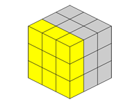 | 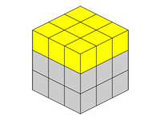 | 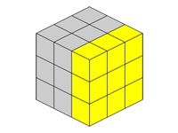 |

| Back | Down | Left |
| --- | --- | --- |
|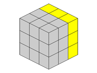 | 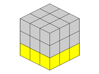 | 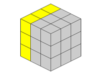 |

| Median | Equator | Standing |
| --- | --- | --- |
| 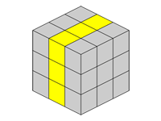 | 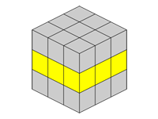 | 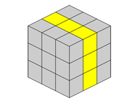 |

### Pieces
- centers (1 color), edges (2 colors), corners (3 colors)  
there is a specific criteria in order to check a correctly oriented piece (for [edges](#edges-orientation) and [corners](#corners-orientation))
- to determine a piece's name:
    - edges: read stickers colors starting from the one in position `U`, `D`, `F` or `B`  
eg. `FR`, `BL`, `UL`, `DF`, `UB`, ... are correctly oriented
    - corners: read stickers colors starting from the one in position `U` or `D` and go on clockwise  
eg. `UFL`, `URF`, `ULB`, `DLF`, `DRB`, ... are correctly oriented  
however `LUF` should be oriented counterclockwise and `FLU` should be oriented clockwise
- to get practice, place your thumb on the first sticker, your index finger on the second one and the middle finger on the third: this way you'll read colors clockwise

| Centers | Edges | Corners |
| --- | --- | --- |
| 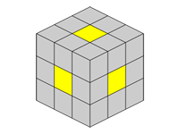 | 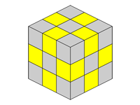 | 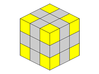 |

### Moves
- clockwise (`F`, `R`, `U`) and counterclockwise (`F'`, `R'`, `U'` or `Fi`, `Ri`, `Ui`)
- the full cube rotation is specified with the rotation axis in lower case: after the cube rotation, faces names won't matches anymore their original colors.
    - note: after executing `x'`, face `B` became `U`, face `U` became `F` and so on...
- eventually lower case letters can be used (`f`, `r'`, `ui`, ...): this is intended for specify more than one face or slice
    - eg. `r'` equals `x'L'` (or `R'M`)

Note:
- lower case letters are mostly used referring to bigger cubes (4x4, 5x5, ...) where, for instance, `r` means face `R` rotation along with all other layers between `R` and `M` (latter not included)
- keep in mind these comparisons when thinking about face/slice/cube rotations
    - `M` = `L`
    - `x` = `R`
    - `y` e `E` = `U`
    - `z` e `S` = `F`

## Introduction

### How the blindfold method works (basis)
- this method allows to solve the cube without rotate it, as other methods do ([“beginners”](http://www.youcandothecube.com/secret-unlocked/solution-stage-one.aspx), [Fridrich](http://en.wikipedia.org/wiki/CFOP_Method), ...), and placing on piece at a time keeping the rest of the cube unmodified.
- this way is possible to memorize the full sequence of pieces in order to solve the whole cube
- convention wants to have the cube facing the red face on position `F` and the yellow one on position `U` (so  `L`=blue, `R`=green, `B`=orange, `D`=white)

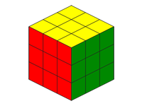

### How M2R2 works (basis)
- all permutation patterns for edges and corners of `L` and `R` faces are composed this way:  
Setup -> M2 or R2 -> UnSetup
- every single piece have a Setup move
- the Unsetup move is the exact inverse of its Setup move  
eg. U’LU -> M2 -> U’L’U
- every permutation pattern includes `M2` or `R2` move, this way it needs 2 patterns to be executed in order to have the cube exactly the same it was before concerning pieces not interested in the patterns  
eg. after executing `FR` and `FL` the cube is the same as before, except pieces `FR` and `FL`

### What are and "buffer" pieces and what's their purpose
- pieces in position `DF` (edge) and `DFR` (corner) are named _*buffer*_
- M2R2 method foresee the permutation of one piece at a time from _buffer_ position to _"target"_ position (the correct one)
- the buffer piece will be swapped with the one in target position at every permutation
- the Setup move swap the piece in the _target_ position with the one opposite to _buffer_ (`UB` and `UBR`)
- when the second piece of a couple of permutations is the _buffer_ piece and every other piece of the same kind (edges or corners) are in their respective _target_ position (excluded the piece opposed to _buffer_), then is the case of [Parity](#parity) (about 50% of solving processes)

### Before starting
- get familiarity with pieces and moves naming starting with a solved cube
- try to execute each following pattern twice (first time to understand its purpose, second one to get the cube back to initial state)
- given this method places 2 pieces at a time, in order to permutate pieces on `M` slice (edges) or `R` face (corners) keep in mind their target position for in the second permutation `M` or `R` will be rotated by 180°
    - eg. edges:  
if the first of 2 pieces to be permutated is `UF`, execute pattern `UF`  
if `UF` is the second one (and so `M` is rotated), execute the opposite pattern (that is `DB`)
    - eg. corners:  
if the first of 2 pieces to be permutated is `URF`, execute pattern `URF`  
if `URF` is the second one (and so `R` is rotated), execute the opposite pattern (that is `DRB`)

## Edges orientation
(1 common use pattern, 2 rare patterns)

### establish which edges need to be oriented
- check every piece's colors and their positions on its faces
- on faces `U`, `D`, `F` and `B` there shouldn't be neither `L` neither `R`
- edges that need to be oriented are always in pairs (can be 2, 4, 6, ...)
- following first 2 patterns will orient 2 or 4 pieces on `U` face
- apply Setup/Unsetup logic to bring on the `U` face all edges that need orientation (this can include eventually the full cube rotation)

### 2 edges orientation
- `(M'U)*3 U (MU)*3 U`

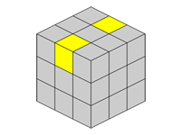

### 4 edges orientation
- `(M'U)*4 (MU)*4`

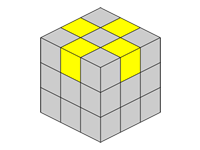

### 4 edges orientation (2 of them on different face)
- `(M'U)*4` or `(MU)*4`

## Edges permutation
(10 patterns)

### Edges for faces L e R
Note:
- all pattern for `L` face have the first `U` move counterclockwise
- all pattern for `R` face have the first `U` move clockwise

#### L face
- `BL`: `U'LU    M2  U'L'U`
- `FL`: `U'L'U   M2  U'LU`
- `DL`: `U'L2U   M2  U'L2U`
- `UL`: `LU'L'U  M2  U'LUL'`

#### R face
- `BR`: `UR'U'   M2  URU'`
- `FR`: `URU'    M2  UR'U'`
- `DR`: `UR2U'   M2  UR2U'`
- `UR`: `R'URU'  M2  UR'U'R`

### M-edges permutation
Note:
- keep in mind the _target_ position
- patterns `UF` and `DB` are respectively one the inverse of the other

Patterns:
- `DF`: _buffer_
- `UB`: `M2`
- `UF`: `[U2M']*2`
- `DB`: `[MU2]*2`

## Corners orientation
(4 patterns)

### establish which corners need to be oriented
- check every piece's colors and their positions on its faces
- on faces `U` and `D` there should be only those colors (`U` or `D`)
- corners that need to be oriented can be 2 or 3 (or multiples of)
- if 2 corners need to be oriented, then they'll have **inverse** orientation
- if 3 corners need to be oriented, then they'll have **the same** orientation
- following patterns will orient the corner in `UFL` position
- in order to orient 2 or 3 corners, execute the right pattern and rotate `L` face to swap pieces
- apply Setup/Unsetup logic to bring on the `U` face all edges that need orientation (this can include eventually the full cube rotation)

Note:
- in every pattern couple, one is the inverse of the other
- if the corner in `UFL` needs a clockwise orientation, start with the pattern with `R` clockwise (and viceversa)

### 2 corner orientation
- `U' RUR'U'R  U` (clockwise)
- `U' R'URU'R' U` (counterclockwise)

### 3 corners orientation
- `R'U' RU R'U' RU` (clockwise)
- `U'R' UR U'R' UR` (counterclockwise)

## Corners permutation
(6 patterns)

### L face
Note for `DBL` and `UFL` patterns:
- first half of these Setup patterns move the piece in `ULB` position
- second half of these Setup patterns **is** the `ULB` pattern

Patterns:
- `ULB`: `L'U'LU         R2  U'L'UL`
- `DLF`: `U'L2U          R2  U'L2U`
- `DBL`: `U'L2U  L'U'LU  R2  U'L'UL U'L2U`
- `UFL`: `LU'L'U L'U'LU  R2  U'L'UL U'LUL'`

### R face
Note:
- keep in mind the _target_ position
- patterns `URF` and `DRB` are respectively one the inverse of the other

Patterns:
- `DFR`: _buffer_
- `UBR`: `R2`
- `URF`: `U'RF'rU      R2  U'r'FRU R2`
- `DRB`: `R2 U'R'F'rU  R2  U'r'FR'U`

## Edges orientation and permutation
(8 patterns: 1 new pattern for every edge of L and R)

#### L face
- `LB`: `x L'ULU'  M2  UL'U'L x'`
- `LF`: `x UL2U'   M2  UL2U'  x'`
- `LD`: `x ULU'    M2  UL'U'  x'`
- `LU`: `x UL'U'   M2  ULU'   x'`

#### R face
- `RB`: `x RU'R'U  M2  U'RUR' x'`
- `RF`: `x U'R2U   M2  U'R2U  x'`
- `RD`: `x U'R'U   M2  U'RU   x'`
- `RU`: `x U'RU    M2  U'R'U  x'`

## Corners orientation and permutation
(14 patterns: 2 new patterns for every corner but the buffer)

### L face
- `BUL`: `y RU R2 U'R'  F2  RU R2 U'R' y'`
- `LBU`: `U' L' U       R2  U' L U`
- `FDL`: `U'L' U L'U' LU  R2  U'L' UL U' LU`
- `LFD`: `L2 U'L'U        R2  U'LU L2`
- `LDB`: `LU'L'U  R2  U'LUL'`
- `BLD`: `U'LU    R2  U'L'U`
- `LUF`: `L'U'L'U  R2  U'LUL`
- `FLU`: `R' ULU'  R2  UL'U' R`

### R face
- `RDF`: _buffer_
- `FRD`: _buffer_
- `RUB`: `U' LU L'U' LU   R2  U'L' UL U'L' U`
- `BRU`: `U'L' UL U'L' U  R2  U' LU L'U' LU`
- `FUR`: `R2 U'R M' x L2M2 ULU' R' UL'U'L' R' U`
- `RFU`: `F'RU R2 U'R'F RU R2 U'R`
- `BDR`: `RUR' D L2 x2 U'RU L2 x2 U' D' R`
- `RBD`: `R'U R2 U'R'F' RU R2 U'R'F`

## Parity
(1 pattern)

- the parity involves 2 edges and 2 corners that need to be swapped
- in order to solve the parity, place your pieces in J-Perm position (a PLL pattern from the [CFOP method](http://en.wikipedia.org/wiki/CFOP_Method)) and then execute the pattern
- use Setup/Unsetup logic to set the pieces ready to be swapped
    - Setup:   `U'F2`
    - J-perm:  `L'U2 LU L'U2 RU' LUR'`
    - UnSetup: `F2U`

The Parity case and the cube after the Parity Setup (`U'F2`)

| Parity | J-perm |
| --- | --- |
| 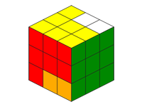 | 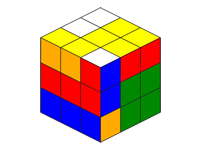 |

The Parity and J-perm involved pieces

| Parity | J-perm |
| --- | --- |
| 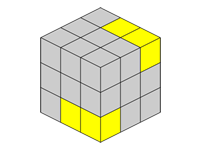 | 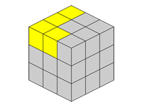 |

## Credits
All patterns are taken from [Stefan Pochmann's M2R2 method](http://www.stefan-pochmann.info/spocc/blindsolving/M2R2/).
